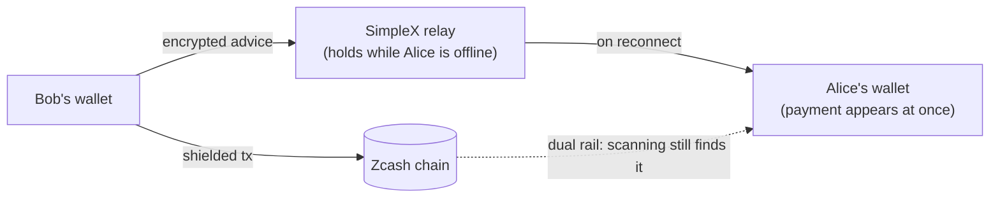
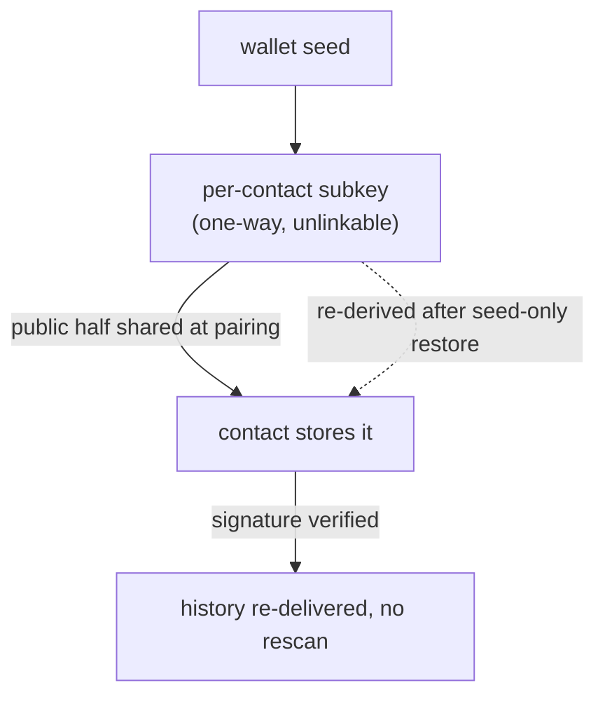

# 🛰️ Axion — an out-of-band channel for Zcash

*Useful today. Essential for Tachyon. And it has to be built now.*

## Contents

- [🎯 The goal](#-the-goal)
- [⏳ Why now and before Tachyon](#-why-now-and-before-tachyon)
- [🚀 Axion Demo #1: Instant Sync](#-axion-demo-1-instant-sync)
- [🔀 How it works](#-how-it-works)
- [🧪 The demo](#-the-demo)
- [📊 The numbers](#-the-numbers)
- [✅ Bottom line](#-bottom-line)
- [🔎 More details](#-more-details)
  - [⚡ Instant sync](#-instant-sync)
  - [🔁 The same channel Tachyon needs](#-the-same-channel-tachyon-needs)
  - [🪝 Optionality & safety](#-optionality--safety)
  - [📡 The channel (SimpleX)](#-the-channel-simplex)
  - [🆔 Starting a payment, and identity](#-starting-a-payment-and-identity)
  - [🔄 A fresh address for every payment](#-a-fresh-address-for-every-payment)
  - [🕵️ How anonymity is preserved](#️-how-anonymity-is-preserved)
  - [🗄️ How retention works](#️-how-retention-works)
  - [🧰 More details on the demo](#-more-details-on-the-demo)
- [🔭 Future work](#-future-work)
  - [⚡ Fast sync (Demo #1)](#-fast-sync-demo-1)
  - [🧭 General Axion architecture](#-general-axion-architecture)

## 🎯 The goal

- 🎯 **Build Zcash's out-of-band channel now** — the delivery layer Tachyon will depend on, ready and battle-tested before activation.
- 🔒 Tachyon takes payment data **off** the chain, so it must reach recipients some other way — this channel.
- 🕳️ It is assumed by Tachyon but **does not exist yet**, and it needs relays, wallet plumbing, abuse control, and real users.
- 🧩 It is general infrastructure: **instant sync (Demo #1) is just the first thing it is good for** — naming and hosted retention follow.

## ⏳ Why now and before Tachyon

> **Build the channel now, not at activation.** This is the core ask.

- 🔥 Waiting means debugging a brand-new delivery network at activation — with real funds on it.
- 🌱 Infrastructure and adoption take time; neither appears on command.
- 🛡️ Start now and the channel hardens in production *before* it becomes load-bearing.
- 💡 We just need a reason people run it today. We have one: faster wallets.

## 🚀 Axion Demo #1: Instant Sync

- ⚡ **Instant sync.** The sender privately says "your payment is in block N"; the wallet shows it immediately instead of scanning the whole chain.
- 🔁 **Same channel Tachyon needs**, shipped early under a reason users already want.
- 🪝 **Optional and safe.** Still a normal shielded tx; if the channel fails, normal scanning finds it. The seed stays the only secret.
- 💰 **A foundation, not a one-off.** The same channel later enables paying anyone by name and hosted long-term retention — both demoable, both potential revenue for zodl.

## 🔀 How it works

## 🧪 The demo

*Runs end-to-end on a local Zcash network — real node, indexer, relay, and CLI wallet.*

- 📡 **Channel — SimpleX.** No accounts, end-to-end encrypted, self-hostable; per-pair queues, and the relay is trusted only to deliver.
- 🆔 **Identity — from the seed.** Per-contact keys let a seed-only restore prove who it is and pull back its history (done in ~1 s, no rescan).
- 🗄️ **Retention — layered.** Sender re-sends until acknowledged; contacts can re-deliver; the chain backs it up until Tachyon — and 💰 hosted long-term retention is a service zodl could offer.
- 🕵️ **Anonymity — end to end.** Each sender gets an unlinkable address (two senders shared **zero** identifiers), and the recipient's fast sync makes the **same indexer requests as any wallet** — the server never learns which payment is hers.

## 📊 The numbers

*Measured on one machine against a local indexer. Time until the expected payment is visible:*

| Recipient offline for… | 🐢 Vanilla wallet | ⚡ Axion wallet |
| ---------------------- | ----------------- | -------------- |
| ~10k payments deep     | 0.6 – 2.3 s       | **~0.2 s**     |
| **~1 month of blocks** | 3.7 – 4.4 s       | **~0.8 s**     |

- 📈 A **2–11× head start** on a fast desktop.
- 📱 On a phone at mainnet volumes — where a full scan is minutes — it stays sub-second.

## ✅ Bottom line

- 🧩 A channel Zcash needs anyway — shipped now as a feature users want.
- 🏭 Hardening in production for the day Tachyon makes it essential.
- 🔐 Privacy, safety, and recovery **demonstrated, not promised**.
- ⏰ The only wrong time to start is later.

---

## 🔎 More details

*Each bullet from the sections above, expanded.*

### ⚡ Instant sync

The sender already knows exactly where the note it just created lives — the
transaction, its block, and the output index. It hands that to the recipient
as a tiny signed message. When the recipient's wallet comes online it does not
change what it downloads; it still pulls the same blocks any wallet would. What
changes is order: it decrypts the *advised* block first, so the expected
payment appears at once, then keeps scanning the rest in the background so
nothing else is missed. The speed comes from skipping straight to the answer,
not from trusting anyone.

### 🔁 The same channel Tachyon needs

The delivery path this builds — relays that hold messages for offline
recipients, wallet integration, abuse control, and real operational
experience — is precisely what Tachyon requires once the chain stops carrying
payment ciphertexts. The messages are versioned, self-contained signed
documents that are independent of how they were delivered. So when Tachyon
arrives, the same envelope simply carries the note secrets instead of a
pointer to the chain, and the transport underneath does not have to be
re-architected. Nothing here is throwaway.

### 🪝 Optionality & safety

Every Axion payment is an ordinary shielded transaction on the Zcash chain,
discoverable by scanning like any other. That gives us a dual rail: the fast
channel is an accelerator, and the chain is always the backstop. If the relay
is down, the message is lost, or the recipient never adopted Axion at all, the
wallet still finds the payment by normal scanning, and funds are still
recoverable from the seed phrase alone. A wallet that ignores Axion behaves
exactly as it does today, and none of this needs a consensus change.

### 📡 The channel (SimpleX)

SimpleX is a messaging protocol with no user accounts or identifiers at all —
there is no profile for a relay to leak, and nothing tied to a real identity to
censor. Traffic is end-to-end encrypted with forward secrecy, and every pair of
correspondents gets its own queues on servers the recipient chooses. So the
relay is trusted for exactly one thing: **delivery** — holding messages until
they are fetched. It cannot read content (encryption), cannot forge a payment
notice (every message is signed), and stores no long-term identity to target;
and because it is self-hostable and replaceable, even that delivery role has no
lock-in. Being honest about the limits: the relay does see that the messages on
a given queue belong to a single sender-recipient relationship, and
network-level metadata — IP addresses and timing — can still correlate traffic.
Those are real residual leaks, addressed later with Tor, uniform message sizes,
and timing jitter, not by this first step.

### 🆔 Starting a payment, and identity

Start with the story — what sending a payment actually looks like.

- 👤 **Someone you already know.** Alice is in Bob's contact list, so Bob picks
  her and pays. No address to copy, no QR. His wallet already holds a fresh,
  single-use address for her and the private channel to reach her; it
  broadcasts the ordinary shielded transaction and sends the advice. Done.
- 🤝 **Someone new.** They exchange one thing, once: Alice shows a QR — a
  contact token — and Bob scans it. That single scan sets up the private
  channel and gives Bob his first address for Alice. Every later payment is the
  "already know" flow above.
- 🌐 **Someone you can never meet** — a donation link, a stranger — is beyond
  this first step, but the same channel extends to it. A later **naming layer**
  maps a human name to a channel and a pool of pre-made addresses, so anyone can
  pay `alice.zec` without her ever being online. 💰 It is very demoable and a
  natural revenue line for zodl (name registration, renewals, hosting).

Now what is actually shared, and why it's safe. Alice mints a **different token
for each contact** — a distinct key and a distinct address per person — all
derived from her single wallet seed, so she keeps nothing extra *and* no two
contacts can be linked to each other. A token carries three things:

- 🔑 a per-contact public **identity key**,
- 🏠 a fresh **receiving address** for that contact,
- 📮 the **channel endpoint** (where to reach her) — all signed.

The identity key comes from two one-way steps (seed → private root → per-contact
subkey), so a sender who holds it learns nothing about her root or her other
contacts. While the channel is alive that key sits unused; its real job is
recovery: a wallet restored from only its seed re-derives the same key, opens a
new channel, and signs a challenge the contact verifies against the key it
stored at pairing — proving it is the same person, who can then pull its whole
history back.

The channel is two-way, but *paying* is one-way per token: only the side that
handed out an address can be paid on it. If the other side later wants to
receive too, it hands out a token of its own — over the already-open channel,
so it is a single message, not a fresh QR exchange.

### 🔄 A fresh address for every payment

A sender cannot mint new addresses for the recipient on his own — that needs
her secret keys — so she supplies them, riding along on a message she already
sends. Every acknowledgment she returns after a payment carries the **next
fresh address**, and the sender always pays the newest one he holds. No extra
messages, no pre-batching. If she is offline across several of his payments,
they simply reuse the newest address he knows, and the sequence catches up once
her acknowledgments arrive. Reusing an address costs nothing on-chain — note
commitments hide the receiving address, so even repeated payments to one
address are unlinkable on the ledger — but a fresh address per payment means
that if one payment's details ever surface (a dispute, an invoice, a leaked
message), the address they reveal is shared with no other payment. It also
lines up with Tachyon, whose payment capabilities are single-use by design.

### 🕵️ How anonymity is preserved

Anonymity is protected at three independent layers:

- ⛓️ **On the chain — per-sender addresses.** Each contact is paid at a
  different address, and a fresh one each time via the ratchet above, so
  records leaked from two senders share no common value — we confirmed two
  senders paying one recipient end with zero identifiers in common. It costs
  nothing: every such address is found with the recipient's single viewing key.
- 📨 **At the relay — per-pair queues, honestly bounded.** The relay reads
  nothing (encryption) and stores no identity, and separate senders use separate
  queues so it cannot link a recipient's different relationships. But it does
  see that messages on one queue belong to one relationship, and IP/timing
  metadata can still correlate traffic — real residual leaks, mitigated later by
  Tor, uniform sizes, and jitter, not by this step.
- 🔭 **At the indexer — no targeted lookup.** The recipient's fast sync makes
  the same block requests as any wallet and never asks for a specific
  transaction, so the server cannot tell which payment is hers — asking would
  be nearly as revealing as handing over her viewing key.

### 🗄️ How retention works

No single component is trusted to remember a payment, because losing that
memory would eventually mean losing access to funds. The sender keeps every
notice in an outbox until the recipient acknowledges it, and re-sends on
reconnection — and that same acknowledgment is what advances the address
ratchet described above, so retention and address rotation ride on one message.
Because channels are two-way and each contact keeps its own outbox, any contact
can re-deliver history on request — the contact graph itself becomes a
distributed backup. Today the chain is the ultimate backstop; after Tachyon
removes it, replication across multiple mailboxes plus an encrypted wallet
backup becomes the durable store, all of it automatic and never entrusted to
the user.

💰 This is also a business. Keeping your payment records available for the life
of your funds is exactly the kind of guarantee a bank provides — and it is one
zodl can offer directly: hosted, long-retention mailboxes as a paid service,
paid for anonymously so the operator still cannot link a customer to a payment.
Users who want stronger assurance simply publish several mailboxes; zodl running
some of them is a natural, recurring revenue line.

### 🧰 More details on the demo

Everything below runs from a clone — no mocks — and is documented in `DEMO.md`.

**The stack** (all reused off-the-shelf except the wallet):

- ⛓️ **zebrad** — the Zcash node, in regtest, from the official Docker image (`zfnd/zebra:6.2.2`).
- 🗂️ **Zaino** — the indexer that replaces lightwalletd, built from source (`zingolabs/zaino`).
- 📡 **smp-server** + **simplex-chat** — the SimpleX relay and clients (official image `simplexchat/smp-server:v6.5.2`, CLI `v6.5.6`).
- 👛 **zcash-devtool** — Zcash's own reference CLI wallet, which we forked; it sits on `librustzcash` (unchanged).

**What we actually wrote** — a new `advice` command family in the wallet fork
(branch `axion-advice`): the channel client, identity
and key derivation, the outbox/store, pairing, send, receive, acknowledge,
flush, rotate, recover, and re-deliver — plus small edits to the sync path so
the private fast-sync reuses the normal scanner. It ships with **49 unit
tests** and passed **two independent adversarial code reviews** (findings on
channel binding, replay, and key handling all fixed).

**How it is run** — one command, `devenv up`, starts the whole stack (node,
indexer, relay, three wallets) as background services. Then scripted scenarios
each produce the results above:

- 🏁 `demo-race` — the fast-sync head-to-head vs a vanilla wallet.
- ♻️ `demo-recover-*` — seed-only recovery via re-delivery.
- 🕵️ `demo-unlinkability` — two senders, zero shared identifiers.
- 📈 `demo-scaling` — the numbers table at 3.6k / 10k outputs and the 1-month gap.

---

## 🔭 Future work

### ⚡ Fast sync (Demo #1)

- 🌊 **Stream-and-peek.** Today the private path downloads the whole gap before it decrypts the advised block; peeking as soon as that block streams in would cut the wait for a just-received payment.
- 💸 **Instant spendability.** Fast sync surfaces the payment; folding in the advised note's commitment-tree position would make it immediately *spendable*, not just visible.

### 🧭 General Axion architecture

- 🧅 **Network metadata.** Tor with uniform message sizes and timing jitter, to close the IP/timing residual leaks noted above.
- 🔐 **Post-quantum identity.** The MVP uses a simple Ed25519 per-contact key; a post-quantum signature scheme is a drop-in follow-up (the identity format is versioned).
- 🌐 **Naming layer.** Pay anyone by name via a private name → address-pool lookup (Axion Demo #2).
- 🗄️ **Durable retention.** Multi-homed mailboxes plus encrypted backup as the post-Tachyon store — and a hosted service.
- 📦 **Tachyon payload.** Swap the advice pointer for the note secrets once the chain stops carrying ciphertexts.
